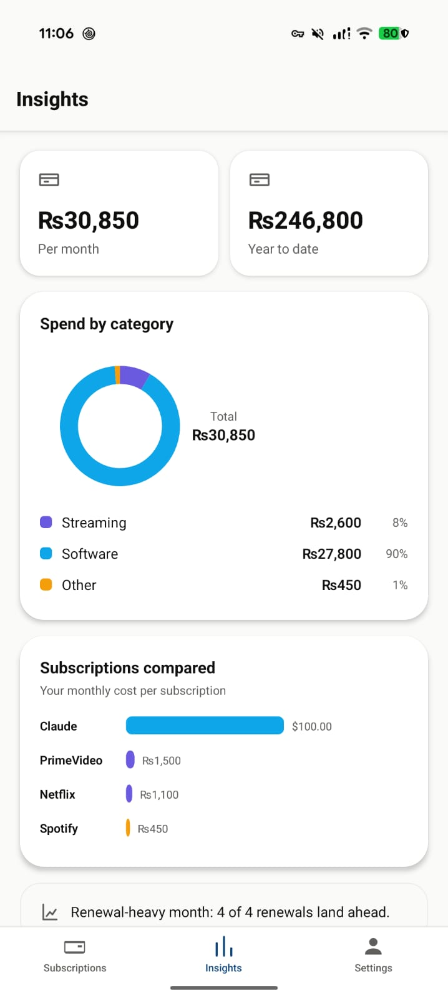
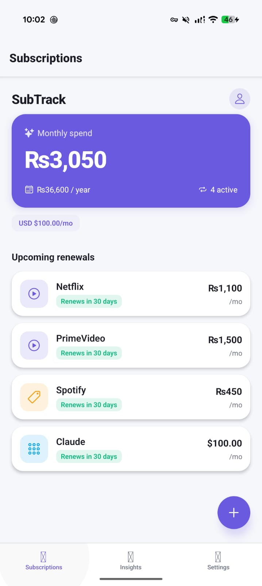

# SubTrack

A subscription tracker that shows you every recurring charge in one place — what you pay, when it renews, and where your money actually goes.

> **Note:** This repository is a **from-scratch rebuild of the original Flutter app in React Native (Expo)**. The Flutter version was replaced with this React Native implementation to make the codebase easier to troubleshoot and extend. All core features from the original are preserved.

---

## Features

- **Subscriptions** — add, edit, and delete subscriptions with name, price, billing cycle (monthly/yearly), next renewal date, category, and currency.
- **Dashboard** — a hero summary of your monthly spend and yearly run-rate, plus an "Upcoming renewals" list with per-subscription renewal-countdown pills (sage = healthy, amber = soon).
- **Insights** — a spend-by-category donut, a per-subscription comparison bar chart, and month-over-month renewal trends.
- **Multi-currency** — 10 currencies (PKR default). The dashboard total and Insights aggregate **all** currencies by converting into the default (approximate static rates), so a USD subscription counts toward your total.
- **Local premium mock** — free tier of 5 subscriptions; "unlock" is a local flag (no backend, no real payments). Onboarding is also a local flag.
- **Local renewal reminders** — scheduled notifications 2 days before each renewal (on-device only).
- **Settings** — default currency picker, reminder permission, plan, and a local profile (display name, stored on-device), plus "delete all data".
- **Cycle-mark app icon** — a custom adaptive icon (open loop + dot, "renews forever") in dusty blue.

## Screenshots

| Dashboard & Insights | Settings & Profile |
| --- | --- |
|  |  |

## Tech stack

- **React Native** via **Expo** (plain JavaScript, no TypeScript)
- **React Navigation** — native stack + bottom tabs
- **expo-sqlite** — local SQLite storage (`subscriptions` + `kv` tables)
- **expo-notifications** — local renewal reminders
- **react-native-svg** — Insights charts and the custom SVG icon set
- **Zustand** — lightweight state stores

## Theming

The UI uses a single accent token with a small set of supporting colors (see `src/theme.js`):

| Role | Hex | Used for |
| --- | --- | --- |
| Accent | `#6E8FA8` | Hero card, FAB, active tab, buttons, logo |
| Secondary | `#B9CBD6` | Text/icons on the accent surfaces |
| Warm tan | `#E3D9C6` | "Other" category chip accent |
| Near-black | `#0F0F0E` | Titles, main text |
| Warm gray | `#5F5E5A` | Icon glyphs, secondary labels |
| Muted gray | `#8A887F` | "/mo" small text |
| Light tint | `#F1EFE8` | Icon chip / avatar backgrounds |
| Sage / Amber | `#3B6D11`/`#854F0B` | Renewal pills (healthy / soon) |
| Page bg | `#FAFAF8` | App background |
| Hairline | `#E5E3DC` | Dividers |

All colors live in `src/theme.js` and are re-exported from `src/components/ui.js` so screens can import them from one place.

## Icons

Icons are rendered with a **self-contained SVG component** (`src/components/Icon.js`) rather than a font, so they always render (no font-loading failures). Each glyph is a 24×24 viewBox path.

## Project structure

```
src/
  App.js                 # Entry: boot DB/notifications/stores, onboarding gate, nav
  theme.js               # Color tokens
  components/
    ui.js                # Card, Chip, buttons, hexA(), re-exported theme tokens
    Icon.js              # SVG icon set
  models/                # sub, currency (format + conversion), category
  stores/                # subs, premium, currency, profile (Zustand)
  services/
    notifications.js     # Local renewal reminders
  screens/               # Onboarding, Dashboard, AddEdit, Insights, Paywall, Settings, Crash
  db.js                  # expo-sqlite open + migrations + kv helpers
  utils/format.js        # uuid, date formatting
android/                 # Prebuilt native project (icon, gradle config)
```

## Getting started

Prerequisites: Node 18+, and the Expo CLI (`npx expo`).

```bash
npm install
npx expo start          # open in Expo Go or your dev client
```

To run on a physical Android device / build an APK:

```bash
npx expo prebuild --platform android
cd android && ./gradlew assembleDebug
adb install -r android/app/build/outputs/apk/debug/app-debug.apk
```

> The debug build is configured to bundle the JS (the React Native Gradle plugin
> otherwise expects the Metro dev server). See `android/app/build.gradle`
> (`debuggableVariants = []`).

## Notes / limitations

- No backend: data, premium, and profile are all local (SQLite + on-device flags).
- Multi-currency aggregation uses **static approximate rates** (`RATE_TO_PKR` in `src/models/currency.js`), not live FX. Swap in a rates API for real conversions.
- Notifications are local reminders only.
